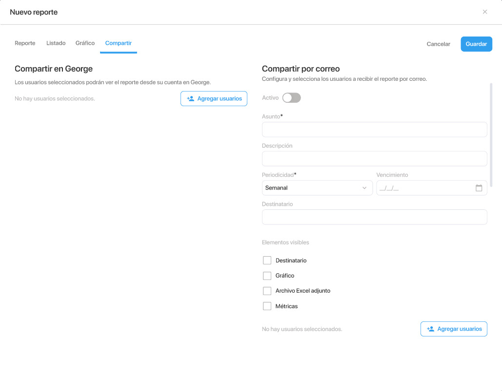
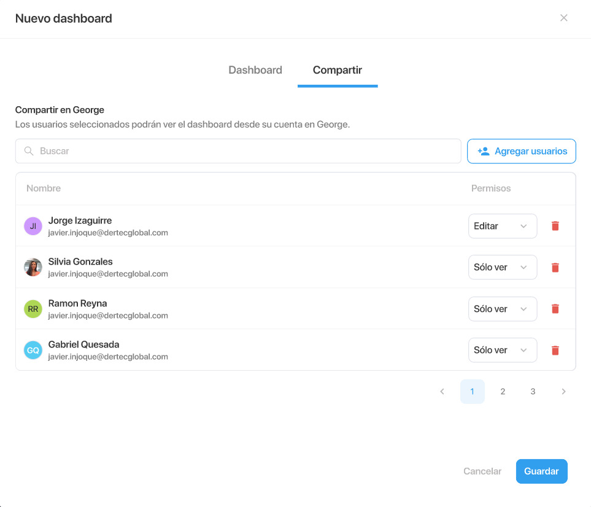
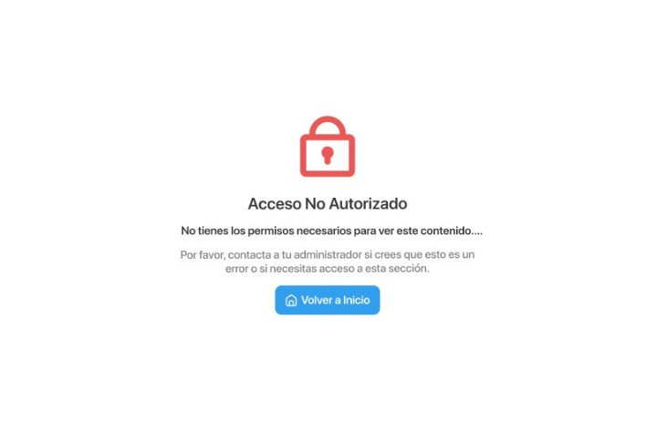

# README.md

## Prueba Técnica - Reporte y Dashboard

### 2. Resultado en cada HTML

#### [`reporte.html`](https://ckodda.github.io/reporte.html)

#### [`dashboard.html`](https://ckodda.github.io/dashboard.html)

#### [`error.html`](https://ckodda.github.io/error.html)


## Visualización

A continuación, se muestran capturas de pantalla de cada vista (references/):

- **Reporte:**  
  
- **Dashboard:**  
  
- **Error:**  
  

---

## Estructura del Proyecto

```
dashboard.html
error.html
reporte.html
css/
    bootstrap-datepicker.min.css
    bootstrap.min.css
    custom.css
img/
    avatar2.jpg
js/
    bootstrap-datepicker.min.js
    bootstrap.bundle.min.js
    jquery.min.js
references/
    screen1.jpg
    screen2.jpg
    screen3.jpg
```

**Autor:**  
Desarrollado como parte de una prueba técnica por Daniel Manuel Córdova Barrientos.
